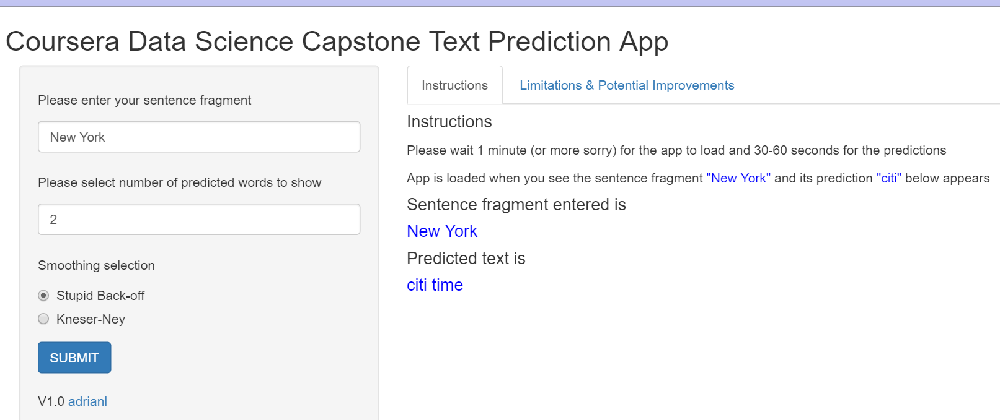

Coursera JHU Data Science Capstone Text Prediction App Presentation
========================================================
author: Adrian Lim
date: April 22 2016
autosize: true
transition: rotate

Overview
========================================================
The aim of this project is to build a shiny app that will allow the user to
enter text and predict the next word from the entered text.

This app is similiar to the popular mobile text prediction app from Swiftkey.

Text Prediction utilises data from a source corpus in this case the [HC Corpora](http://www.corpora.heliohost.org/aboutcorpus.html) corpus.

The basic idea is to count the frequency of words in the corpus in order to predict
the next word in the sentence.

This project goes thru the entire data science process pipeline from getting and cleaning
the data, to exploratory data analysis to developing the prediction algorithm and finally
developing the final data product, a shiny app.

Implementation
========================================================
The 3 corpus files are data from tweets, blogs and news and are several million records in
total. In order to fit into the constraints of memory and storage size as well as processing
time, the corpus was reduced via sampling to around 3% of the total.

The following was then performed on the sample file:
- standardising on lower case characters
- removing punctuation,numbers,whitespace,profanity and common english stopwords
- Tokenise the file using the RWeka and tm libraries.
- Form frequency tables of contigous sequences of trigram, bigram and unigrams.
- Implement the simple stupid backoff model for prediction

The App
========================================================

***
- After the app launches, enter your text fragment on the upper left text box

- You can also choose the number of predicted words which will be shown in order of
descending likelihood.

- You can also choose the prediction algorithm to use. At this point of time due to
time constraints only the stupid backoff model is implemented. Kneser Rey algorithm
actually is also currently implemented as the stupid backoff model.

- Do note that please allow the app up to a minute to load initially (Sorry!)

Conclusion
========================================================
The accuracy of the app is very dependent on the size of the text sample used for tokenization. Larger samples and going to quadgrams will improve accuracy at the expense
of loading and response times.

Further improvements can be made by using more efficient libraries like quanteda instead of
the tm library utilised and/or employing more sophisticated prediction algorithms.

- See the shiny app at <a> https://adrianl66.shinyapps.io/capstone/

- See the code at <a> https://github.com/adrianl66/capstone

- See the Milestone Report at <a> https://rpubs.com/adrianl66/DSCapstone

